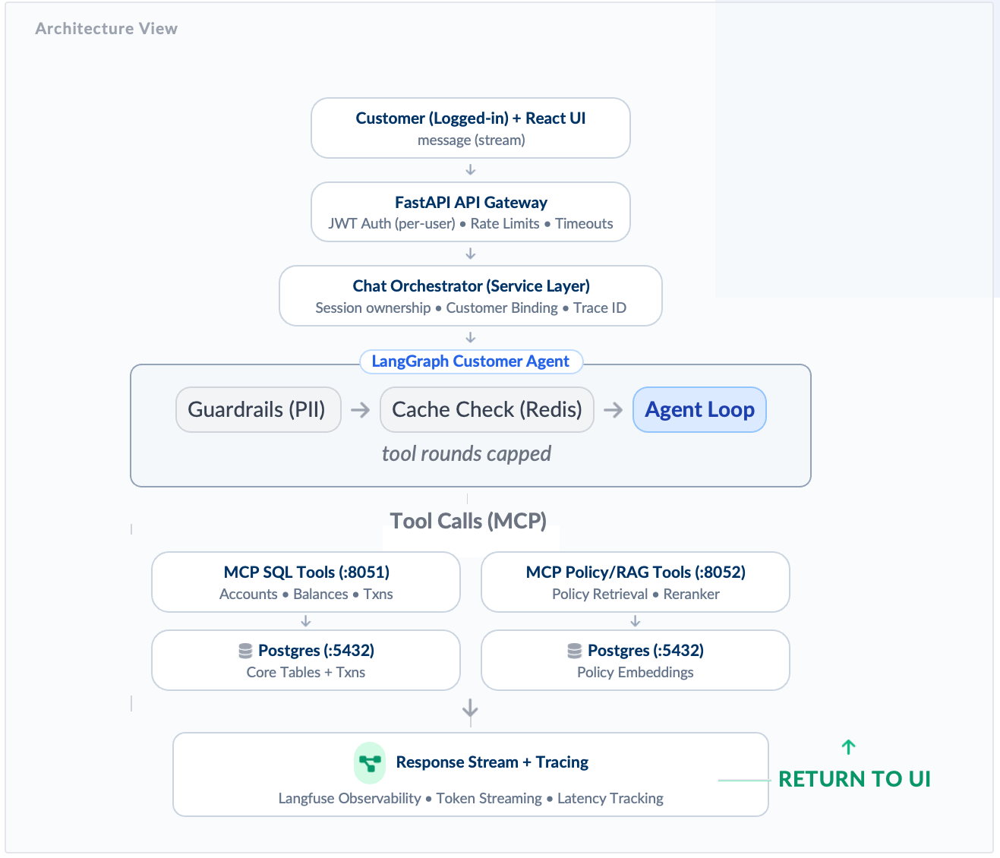

# LangGraph Agent Starter

A production-ready template for building AI agents that can query your own data and documents. Built with LangGraph, FastAPI, and MCP (Model Context Protocol).

Clone it, connect your database, and have a working agent in one `docker-compose up`.

---

## What You Get

- **Multi-turn chat agent** — GPT-4o with tool calling, conversation memory, and context summarization
- **MCP tool servers** — plug in any data source (SQL, REST API, vector DB) as independent HTTP services
- **Semantic cache** — Redis-backed response cache that matches questions by meaning, not exact text
- **JWT authentication** — login, token validation, per-user session isolation
- **Rate limiting + timeouts** — production-safe middleware, configured per endpoint
- **Langfuse tracing** — every LLM call, tool call, and cache hit visible in one trace
- **SQL query framework** — parameterized queries, per-action row limits, timeouts, PII masking
- **Vector search framework** — hybrid dense+sparse search, score normalization, optional reranking

---

## How It Works



The flow from top to bottom:

1. **Customer (React UI)** — sends a message via streaming to the FastAPI gateway
2. **FastAPI API Gateway** — handles JWT auth, rate limiting, and timeouts
3. **Chat Orchestrator (Service Layer)** — manages session ownership and binds a Trace ID for observability
4. **LangGraph Customer Agent** — runs two guards before the agent loop:
   - **Guardrails (PII)** — blocks identity probing and prompt injection
   - **Cache Check (Redis)** — returns a cached answer instantly if the question was seen before
   - **Agent Loop** — GPT-4o calls tools until it has enough information to answer (tool rounds capped)
5. **Tool Calls (MCP)** — the agent calls whichever servers it needs:
   - **MCP SQL Tools (:8051)** — accounts, balances, structured data from PostgreSQL
   - **MCP Policy/RAG Tools (:8052)** — document retrieval via vector search on PostgreSQL embeddings
6. **Response + Tracing** — answer streams back to the UI; Langfuse captures every token, tool call, latency, and cost

The key insight: **your tools run as separate HTTP services** (MCP servers). The agent calls them by name — it doesn't know or care what database they're talking to. Swap the implementation without touching the agent.

---

## Prerequisites

- Docker Desktop (or Docker Engine + Compose v2)
- OpenAI API key (`gpt-4o` access)
- Langfuse account — [cloud.langfuse.com](https://cloud.langfuse.com) (free tier works)

---

## Quick Start

### 1. Copy the environment file

```bash
cp .env.example .env
```

Fill in the required values:

```bash
# .env
POSTGRES_USER=postgres
POSTGRES_PASSWORD=yourpassword
POSTGRES_DB=myapp

REDIS_URL=redis://localhost:6378        # for local dev; Docker sets this automatically

JWT_SECRET_KEY=your-secret-32-char-minimum-key
OPENAI_API_KEY=sk-...

LANGFUSE_PUBLIC_KEY=pk-lf-...
LANGFUSE_SECRET_KEY=sk-lf-...
LANGFUSE_HOST=https://cloud.langfuse.com

REQUEST_TIMEOUT_SECONDS=60
SEMANTIC_CACHE_DISTANCE_THRESHOLD=0.05
```

### 2. Start everything

```bash
docker-compose -f docker/docker-compose.yml up --build
```

This starts:

| Service | Port | What it does |
|---|---|---|
| `api` | 8000 | FastAPI application (the agent lives here) |
| `postgres` | 5432 | PostgreSQL with pgvector extension |
| `redis` | 6378 | Redis Stack (semantic cache + rate limiting) |
| `mcp-data` | 8051 | Your data/SQL tool server |
| `mcp-vector` | 8052 | Your vector search tool server |

### 3. Verify it's running

```bash
curl http://localhost:8000/health
# → {"status": "ok"}
```

### 4. Get a token and chat

```bash
# Login
curl -X POST http://localhost:8000/auth/login \
  -H "Content-Type: application/x-www-form-urlencoded" \
  -d "username=user@example.com&password=yourpassword"

# Create a session
curl -X POST http://localhost:8000/v1/chat/session \
  -H "Authorization: Bearer <token>" \
  -H "Content-Type: application/json" \
  -d '{}'

# Send a message
curl -X POST http://localhost:8000/v1/chat/session/<session_id>/message \
  -H "Authorization: Bearer <token>" \
  -H "Content-Type: application/json" \
  -d '{"content": "Hello, what can you help me with?"}'
```

---

## Connecting Your Data

This is the main thing you need to do. There are two tool servers to fill in.

### Data tools (SQL / API)

**File:** `MCP/server/data_server.py`

This is where you define tools that fetch structured data — user records, orders, account info, anything with a known schema.

Each `@mcp.tool()` function becomes a tool the agent can call. The function signature is automatically converted to a JSON schema that the agent uses.

```python
@mcp.tool()
def getUserProfile(user_id: str) -> dict:
    """Get a user's profile by their ID."""
    return _fetch_user_profile(user_id)   # ← your DB call here
```

Then fill in the data layer at the bottom of the file:

```python
def _fetch_user_profile(user_id: str) -> dict:
    # Example with PostgreSQL:
    with _get_conn() as conn:
        with conn.cursor(cursor_factory=psycopg2.extras.RealDictCursor) as cur:
            cur.execute(
                "SELECT id, name, email FROM users WHERE id = %s",
                (user_id,)
            )
            return dict(cur.fetchone())
```

**The SQL framework** (`app/db/sql/`) gives you patterns for doing this cleanly:

```
app/db/sql/
  queries.py   — parameterized query functions → (sql, params) tuples
  runner.py    — execute safely: timeout, row limit, PII masking
  schemas.py   — Pydantic request/response models with discriminated unions
  actions.py   — per-action policy (max_rows, statement_timeout_ms)
  service.py   — dispatch table: action → query fn → typed response
```

See `app/db/sql/queries.py` for examples of optional filters, date ranges, and aggregations. See `app/db/sql/runner.py` for why `%(param)s` placeholders matter (SQL injection prevention).

### Vector / RAG tools

**File:** `MCP/server/vector_server.py`

This is where you define tools for semantic search — FAQs, documentation, policy documents, anything where the user asks questions in natural language.

Three tools are pre-defined:

| Tool | What it does |
|---|---|
| `rewriteQuery` | Rephrase the user's question for better retrieval |
| `retrieveChunks` | Vector similarity search → top-K chunks |
| `rerankChunks` | Optional: re-score chunks by relevance |

The agent calls them in sequence to answer knowledge-base questions. The `signals.suggest_rerank` flag in the retrieve response tells the agent whether reranking is worth the extra latency.

**The vector framework** (`app/db/vector/`) gives you the full retrieval stack:

```
app/db/vector/
  models.py    — DocumentHit, DocumentFilters, RerankConfig
  queries.py   — dense_search, sparse_search, hybrid_search (pgvector)
  rerank.py    — trigger logic, HTTP reranker backend, graceful fallback
  retriever.py — orchestrates search + rerank, embedding cache
```

`DocumentRetriever` is already wired into `vector_server.py` — you just need to point it at your chunk table.

---

## The MCP → LangChain Bridge

Write a Python function with type annotations and a docstring — the framework converts it into a LangChain tool the agent can call automatically. No manual schema writing, no boilerplate.

```python
@mcp.tool()
def getOrderStatus(order_id: str) -> dict:
    """Get the current status and estimated delivery date for an order."""
    return {"order_id": order_id, "status": "shipped", "eta": "2024-03-15"}
```

The conversion chain: `@mcp.tool()` → FastMCP HTTP endpoint → JSON Schema → Pydantic model → LangChain `StructuredTool` → `model.bind_tools()` → agent.

For the full MCP setup — adding tools, adding servers, how the bridge works internally — see **[docs/mcp.md](docs/mcp.md)**.

---

## Chat Interface

Each conversation lives in a session scoped to the logged-in user. Messages are stored in memory (fast, no DB round-trips — sessions are lost on restart). The agent loop is capped at 6 tool rounds per message, and long conversations are automatically summarized to stay within the context window.

For the full details — session model, request flow, context management, streaming SSE format, and feedback — see **[docs/chat.md](docs/chat.md)**.

---

## Semantic Cache

The agent caches responses to knowledge-base questions in Redis. Semantically similar questions hit the cache — no LLM call, no tool calls. Personalized queries ("what's my balance?") always bypass the cache.

```
"What is your return policy?"   → MISS → agent answers → stored
"How do I return an item?"      → HIT  → same answer returned immediately
```

**Note:** Redis Stack is required (not plain Redis) — the cache needs the `RedisSearch` module for vector similarity. The docker-compose already uses `redis/redis-stack-server:latest`.

For threshold tuning, clearing the cache, and how the POLICY/PERSONALIZED classifier works — see **[docs/cache.md](docs/cache.md)**.

---

## Project Structure

```
├── app/
│   ├── main.py                     FastAPI entry point, middleware stack
│   ├── auth/                       JWT token creation and validation
│   ├── cache/
│   │   └── semantic_cache.py       Redis semantic cache (lookup + store)
│   ├── db/
│   │   ├── sql/                    SQL query framework
│   │   │   ├── queries.py          ← parameterized query functions
│   │   │   ├── runner.py           ← safe execution (timeout, limit, PII mask)
│   │   │   ├── schemas.py          ← request/response Pydantic models
│   │   │   ├── actions.py          ← per-action policy (max_rows, timeout_ms)
│   │   │   └── service.py          ← dispatch table
│   │   └── vector/                 Vector search framework
│   │       ├── models.py           ← DocumentHit, filters, config
│   │       ├── queries.py          ← dense, sparse, hybrid search (pgvector)
│   │       ├── rerank.py           ← trigger logic + reranker backends
│   │       └── retriever.py        ← orchestrator with embedding cache
│   ├── graphs/
│   │   ├── fintech_graph.py        LangGraph agent state machine
│   │   └── llm_gaurd.py            Identity probing guard
│   ├── integrations/mcp/           MCP → LangChain bridge (don't modify)
│   │   ├── core.py                 MCPMultiClient, server loader
│   │   ├── tool_registry.py        MCP tools → LangChain StructuredTools
│   │   └── mcp_helper.py           JSON Schema → Pydantic, name sanitization
│   ├── middleware/
│   │   └── timeout.py              60s request timeout (bilingual errors)
│   ├── routers/                    HTTP layer (auth, chat, health)
│   ├── schemas/                    Pydantic request/response models
│   └── services/                   Business logic (chat, agent runner)
│
├── MCP/
│   ├── server/
│   │   ├── data_server.py          ← YOUR data tools go here
│   │   └── vector_server.py        ← YOUR vector tools go here
│   └── docker/                     Dockerfiles per MCP server
│
├── docker/
│   ├── docker-compose.yml          Full stack (5 services)
│   ├── Dockerfile                  API image
│   └── initdb/                     PostgreSQL init scripts (schema + pgvector)
│
├── scripts/
│   └── backfill_app_users.py       Seed app users from existing data
│
├── .env.example                    Copy to .env and fill in
└── ARCHITECTURE.md                 Full technical deep dive
```

---

## Authentication

JWT Bearer token auth. Login returns a token; every subsequent request passes it in the `Authorization` header. Users are stored in `core.app_users` (bcrypt-hashed passwords, `is_active` flag). The init scripts create the table — you add users yourself before first run.

For the full flow, user table schema, three ways to add users, and JWT config variables — see **[docs/auth.md](docs/auth.md)**.

---

## Observability (Langfuse)

Every user message generates a Langfuse trace: which tools were called, what the LLM said at each step, token counts, latency, and cost — all linked to the session. MCP tool calls appear as child spans on the same trace, so you can see the full agent→tool→agent chain in one view.

```bash
# .env
LANGFUSE_PUBLIC_KEY=pk-lf-...
LANGFUSE_SECRET_KEY=sk-lf-...
LANGFUSE_HOST=https://cloud.langfuse.com
```

Langfuse is optional — the agent works without it, traces are silently dropped if keys are missing. But without it you're guessing when something is slow or wrong.

For setup, what gets traced, how the MCP trace join works, and session feedback — see **[docs/langfuse.md](docs/langfuse.md)**.

---

## API Reference

All endpoints except `/health` and `/auth/login` require `Authorization: Bearer <token>`.

### Auth

| Method | Endpoint | Rate limit | Body |
|---|---|---|---|
| `POST` | `/auth/login` | 5/min | `username=...&password=...` (form) |

### Chat

| Method | Endpoint | Rate limit | Description |
|---|---|---|---|
| `POST` | `/v1/chat/session` | 10/min | Create session |
| `POST` | `/v1/chat/session/{id}/message` | 20/min | Send message |
| `POST` | `/v1/chat/session/{id}/message:stream` | 20/min | Send message (SSE stream) |
| `POST` | `/v1/chat/session/{id}/feedback` | 20/min | Thumbs up/down |
| `DELETE` | `/v1/chat/session/{id}` | 10/min | Delete session |

### Health

| Method | Endpoint | Description |
|---|---|---|
| `GET` | `/health` | Returns `{"status": "ok"}` |

---

## Production Notes

**Rate limits** are per IP, sliding window. Adjust in the router files.

**Timeout** defaults to 60 seconds. Change with `REQUEST_TIMEOUT_SECONDS` in `.env`. The Uvicorn `--timeout-keep-alive 65` in docker-compose is intentionally 5 seconds longer — gives the app time to return a proper timeout response before the connection drops.

**Workers** are set to 1 for development. For production, increase in docker-compose:
```yaml
command: uv run uvicorn app.main:app --host 0.0.0.0 --port 8000 --workers 4 ...
```

**Redis memory** is capped at 512MB with `allkeys-lru` eviction. The cache loses old entries gracefully when full — the agent just re-answers the question and re-caches it.

**Langfuse** is optional but strongly recommended. Without it you're flying blind on what the agent is doing, how much it costs, and where it's slow.

---

## Learn More

| Guide | What's in it |
|---|---|
| [docs/graph.md](docs/graph.md) | LangGraph state machine, guard customization, PII masking, multi-agent patterns |
| [docs/mcp.md](docs/mcp.md) | MCP tool definition, the full MCP→LangChain bridge, adding servers |
| [docs/chat.md](docs/chat.md) | Session model, request flow, context summarization, streaming |
| [docs/auth.md](docs/auth.md) | JWT flow, user table, adding users, token config |
| [docs/cache.md](docs/cache.md) | POLICY/PERSONALIZED classifier, threshold tuning, Redis Stack |
| [docs/langfuse.md](docs/langfuse.md) | Trace setup, MCP span joining, session feedback, cost dashboard |
| [ARCHITECTURE.md](ARCHITECTURE.md) | Deep dive: all four layers, SQL/vector patterns, agent state machine |
